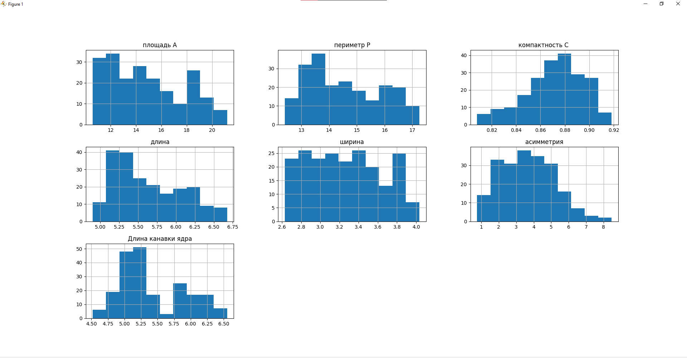
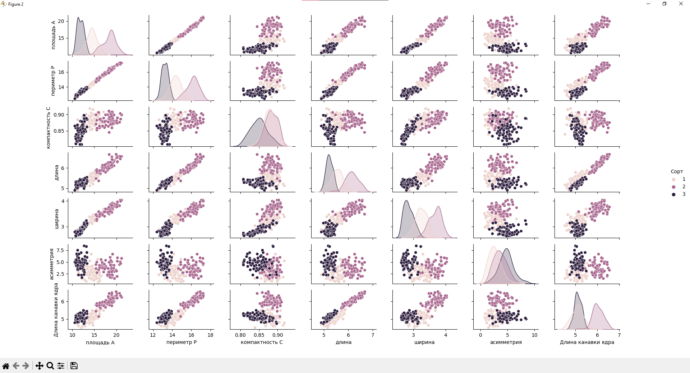
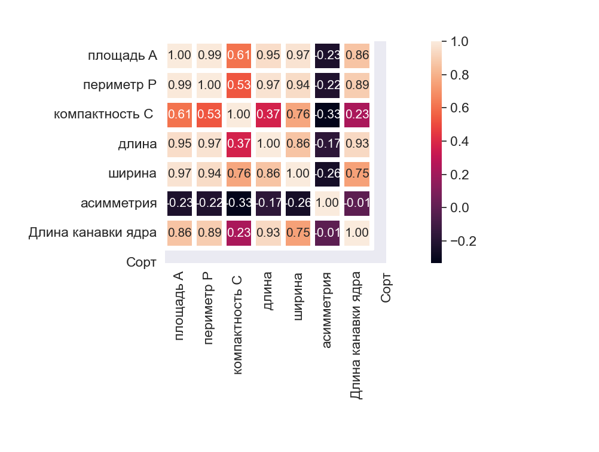

Выводим гистограмму.
 
Рис. 1. Гистограмма по каждому признаку.

Посмотрев на такие гистограммы, можно сказать, что распределение не похоже на нормальное. Попробуем сделать более наглядно. Строим таблицу с зависимостями между признаками и раскрашиваем точки в зависимости от сортов зерна:

  
Рис. 2 Таблица зависимостей.
По таблице видно, что многие признаки имеют сильную зависимость. Их точки вытянуты вдоль одной линии. Для более наглядного вида необходимо построить тепловую карту признаков.

  
Рис. 3. Тепловая карта

Значения коэффициента корреляции интерпретируются следующим образом:

•	До 0,2 — очень слабая корреляция
•	До 0,5 — слабая
•	До 0,7 — средняя
•	До 0,9 — высокая
•	Больше 0,9 — очень высокая
Самая слабая корреляция оказалась у «асимметрии», в основном у многих высокая корреляция.
